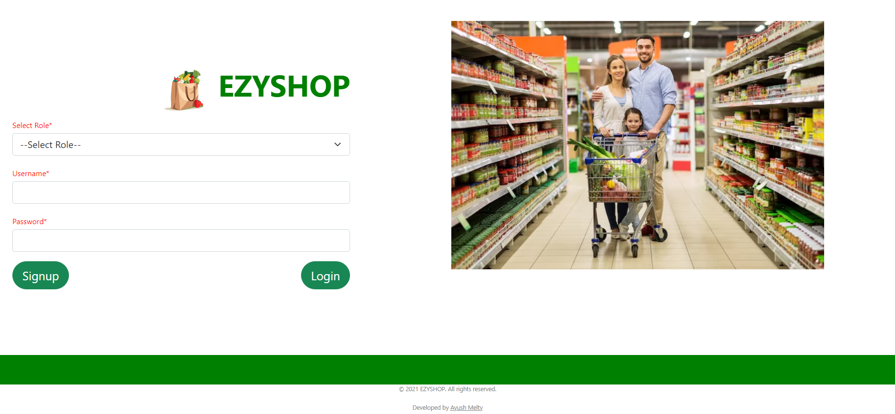
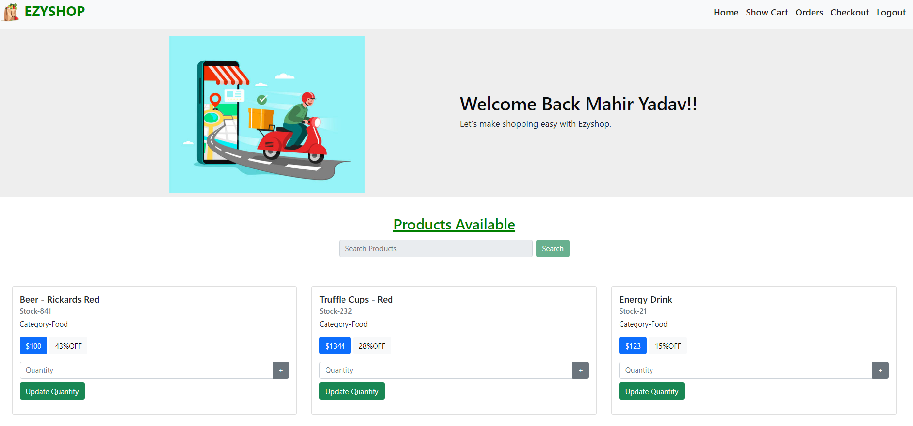
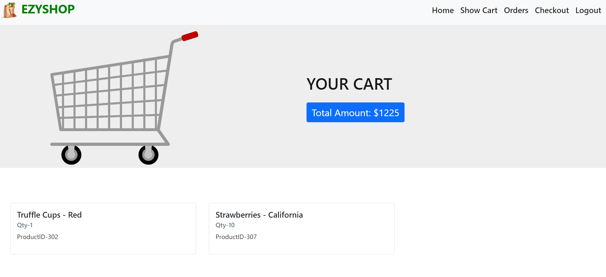
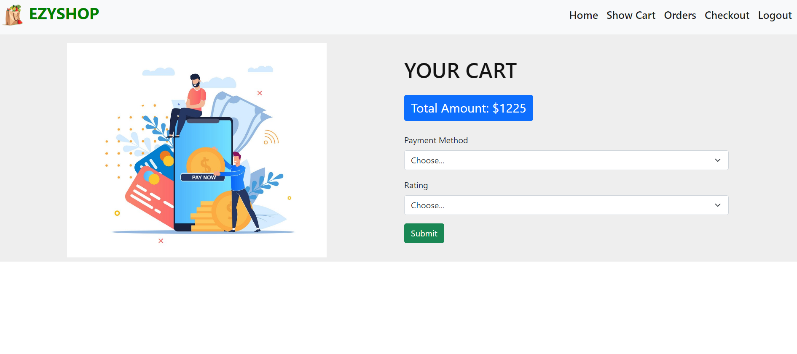
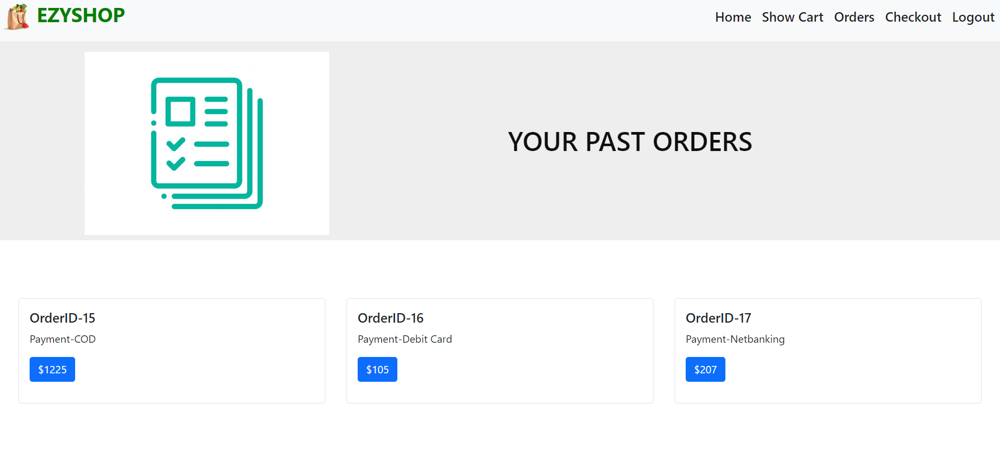
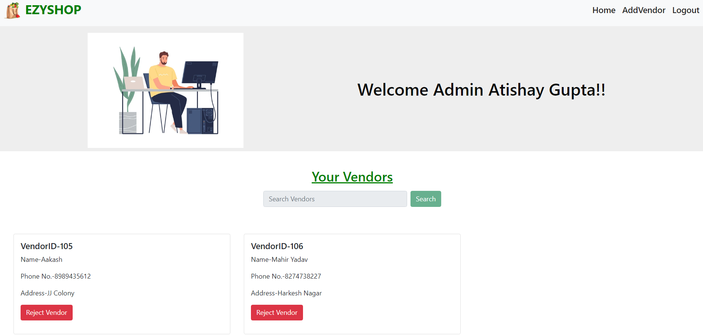
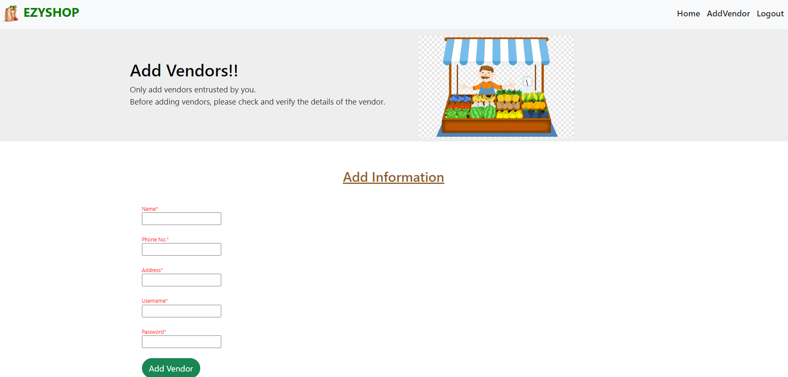
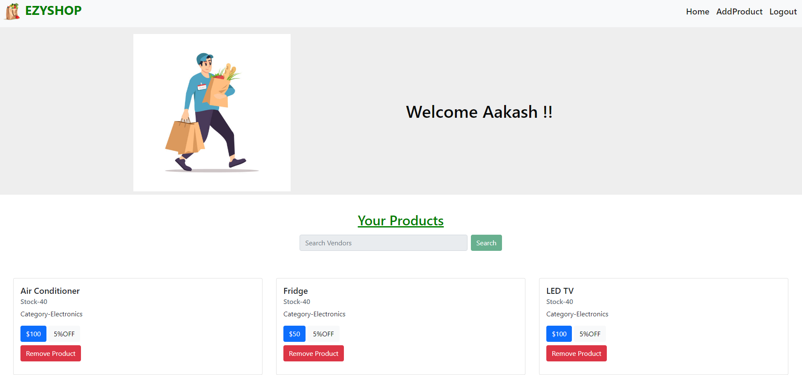
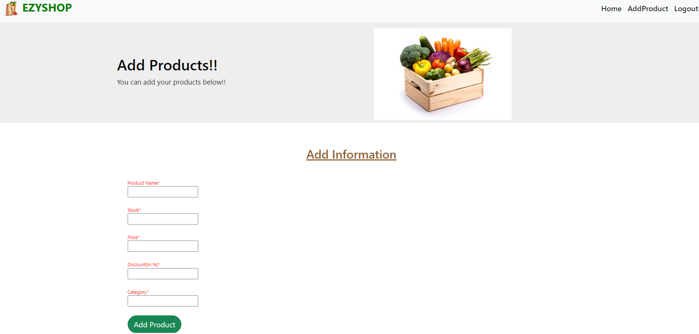

# EzyShop

Ezyshop is a user-friendly e-commerce website designed to make customers' lives easier by providing a seamless shopping experience. Featuring a wide range of products, secure payment options, and an intuitive interface, Ezyshop ensures user satisfaction and convenience.

This Repository consists of all the code including the database sql file. Also it has ER diagram and Relational Schema pdf to better understand the database. There is a separate sql file for triggers and olap queries used.


## Installation

- Open you terminal write the command

```bash
 git clone https://github.com/AyushMelty/Ezyshop-Website.git
```

Load Database in your system

- Run EzyShopDatabase.sql in your MySql workbench
- Make sure that in ezyshop.py you are using your own username and password to connect with MySql.

Run the ezyshop.py file.
## Screenshots of the Website
- Login/Signup Page
  


- Customer Home Page. Customers can browse and add their products to cart here.
  


- Customer Cart. Customers can see their cart here.
  


- Customer Checkout. Customers can checkout their cart here using any payment options they like.
  


- Customer Past Orders.
  


- Admin Home page. From here admins can see the list of vendors working under them. They can reject/kick a vendor under them.
  


- Admin AddVendor. Admins can add new vendor under them by creating account for them.
  


- Vendor Home page. Vendors can see the list of their products on the website currently.
  


- Vendor AddProduct. Vendors can add new products on the website from here.
  

